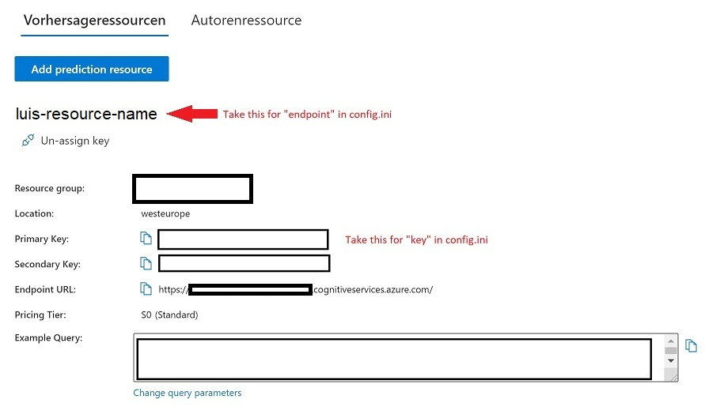

# Get Your Keys
This documentation helps you to find the right keys for Azure Cognitive Services and other Azure resources in order to use the APIs.

## Local Debugging vs. Deployment
There are two different approaches when doing local debugging/development versus deployments. 

Working locally, you use a `config.ini` with inserted keys
1. Create a copy of the `config.sample.ini`
1. Rename it to `config.ini`
1. Insert your keys as described below.

For deployment, you use the file `appsettings.json`:
1. As before, you create a local copy of `appsettings.sample.json`
1. Rename it to `appsettings.json`
1. Insert the keys as described below.

## LUIS
**Used in**: License Plate Recognizer API

1. Open the file you would like to enrich with the LUIS information (`config.ini` or `appsettings.json`)
1. Go to your LUIS app by accessing the [LUIS portal](https://luis.ai)
1. Click on your app and click _MANAGE_
1. In the _Settings_-section, copy the _App ID_ and insert it in the file
1. Afterwards, go to _Azure Resources_ below, make sure you are in the tab _Prediction Resources_ and copy + paste the following keys and names
1. Depending on the staging slot (`staging` or `production`), insert the information as well in your setting file.



### Local Development / Debugging
The final section should look as below, using the example of German/`de`:
Set the respective keys for the `[luis_{language_code}]`-section. If you would like to add another LUIS app, copy the whole section and add the respective language code, such as `[luis_en]`, `[luis_it]` and so on. 
```config
[luis_de]
appid=app_id_goes_here
key=luis_key_goes_here
prediction_endpoint=endpoint_name_goes_here
slot=production
```

### Deployed Version
and set the respective keys for the `[luis_{language_code}]`-section. If you would like to add another LUIS app, copy the whole section and add the respective language code, such as `[luis_en]`, `[luis_it]` and so on. 
```json
{
    "LUIS_ID_DE":"goes_here",
    "LUIS_PREDICTION_ENDPOINT_DE":"goes_here",
    "LUIS_KEY_DE":"goes_here",
    "LUIS_SLOT_DE":"production"
}
```

## Table Storage Connection
**Used in**: Table Requestor API, Authentication API