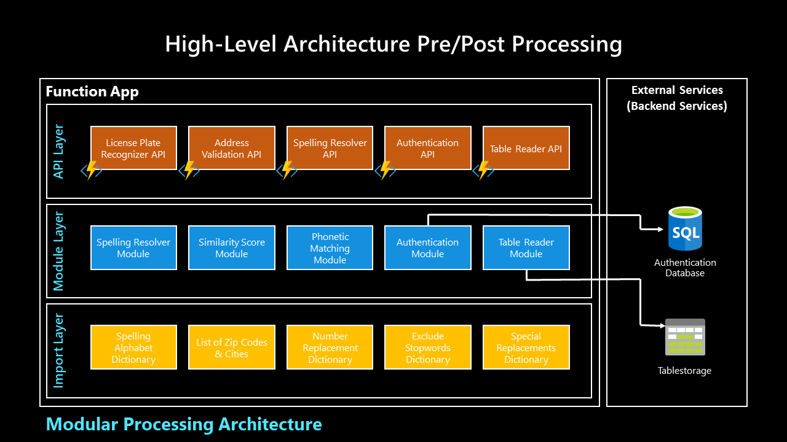

# looky, the smart authentication assistent
looky is a collection of modules, wrapped in multiple APIs that help you to enrich your conversational AI applications in these three fields:
- Validation
- Identification
- Authentication

|                              | Validation                                                                  | Identification                                                                              | Authentication                                                                                                                               |   |
|------------------------------|-----------------------------------------------------------------------------|---------------------------------------------------------------------------------------------|----------------------------------------------------------------------------------------------------------------------------------------------|---|
| Definition                   | Entity extraction + data preparation for backend processing                 | Identify a user or asset                                                                    | Identify a user or asset                                                                                                                     |   |
| Example                      | - License plate format is valid<br>- Customer number format is valid        | - License plate is known in backend system<br>- Customer number exists in customer database | - Combination of validated entities from user input which are verified with authentication database                                          |   |
| Technological <br>approaches | - Via pre/post processing functions based on entities (speech + text input) | - Via pre/post processing functions based on entities (speech + text input)                 | - Via Authentication processing functions based on entities (speech input)<br>- Via Oauth/Identity Provider validated login (e.g. AAD, etc.) |   |

### General approach and goals
The main field of use are intelligent applications with text-and speech input, such as chat bots or voice bots.

- Provide a modular and extendable pre/post processing service
- Support more flexible user input options in conversational scenarios
- Enable extended, context-based understanding of user input
- Take a channel-based approach where appropriate
- Process/UX Flow Best Practices for common scenarios

## High Level Architecture
The image and description below define the general architecture of the VIA system with the respective layers, which are separated in _API Layer_, _Module Layer_, _Import Layer_.



__API Layer__
- Contains function-specific Logic (e.g. Business rules like IBAN structure) and the html request and response handling when using an http-triggered function.

__Module Layer__
- Contains re-usable Processing Logic (e.g. Spelling Resolver). A module can be based on phython classes or functions.

__Import Layer__
- Stores data assets required for the processing (e.g. spelling dictionaries, spelling rules, address table). These can also be split by languages, if support for multiple languages is required.

## Tech Stack
The section below describes the teck stacks on which the API collection is built upon.


### Azure Functions
The basis of the API collection is an [Azure Functions](https://docs.microsoft.com/en-us/azure/azure-functions/functions-overview) component, which is a serverless infrastructure type offered on Microsoft Azure. It acts as webservice and can be triggered as REST-API. Basically, it is available in multiple setups such as C#, JavaScript and Python - in this case we use Python and recommend to use the Python 3.8 runtime. The minimum scale level should be either App Service or ideally Premium Plan (instead of Consumtion/serverless, due to low scaleability level, for testing purposes it is sufficient tho). The description to the respective plans can be found [here](https://docs.microsoft.com/en-us/azure/azure-functions/functions-scale). Depending on your scale, a Function, a storage account and an App Service Plan is deployed in your subscription when creating the resource intially. Further, we prefer the __Code__-based version over a custom __Docker__-container (see differences in the Azure Functions documentation).

Our recommended setup can be deployed to your subscription using the following template:


### Python
We recommend using Python >= 3.7. On top of the Python base installation, some further packages are required to serve the purpose of the API collection. These are listed in the `requirements.txt` with the respective version numbers. When deploying the service, it will automatically be used for transferring and installing it.

Other than that, we leverage [spaCy](https://spacy.io) and [Azure Table Storage](https://azure.microsoft.com/de-de/services/storage/tables/) as additional frameworks and components.

## Deployments
There are generally two ways how to deploy the solution:

```az login```

## Module Definition
The single modules that are used across multiple APIs are all stored in the subfolder `modules` and will be described below. They may also use another module itself when being accessed by an API.

### `license_plate_recognizer.py`

__Functionality:__
- Extracts, resolves and validates car license plates 
- Easily extendible to support more languages by adding word dictionaries in pre-defined structures

__Dependencies:__
- External services or libraries:
    - [Language Understanding Service (LUIS)](https://luis.ai) for extracting license plates from a string
- Modules
    - `resolve_spelling.py`

### `pattern_matcher.py`

__Functionality:__
- Matching of known string patterns to an input string

__Dependencies:__
- External services or libraries:
    - [spaCy](https://spacy.io), required named entity recognition files/models are stored in the `assets/` folder

### `request_table.py`

__Functionality:__
- Request or push data records from/to an [Azure Table Storage](https://azure.microsoft.com/de-de/services/storage/tables/)

__Dependencies:__
- External services or libraries:
    - [Azure Table Storage](https://azure.microsoft.com/de-de/services/storage/tables/) account on Azure

### `resolve_spelling.py`

__Functionality:__
- Advanced text cleaning
- Resolves spelling alphabets in a string as well as letter/number multiplications

__Dependencies:__
- None

### `similarity_score.py`

__Functionality:__
- Calculate similarity of an input string compared to a ground truth string
- Provides different levels of similarity, ranging from exact match to [Levenshtein distance](https://blog.paperspace.com/implementing-levenshtein-distance-word-autocomplete-autocorrect/) and [phonetic matching](https://github.com/jamesturk/jellyfish)

__Dependencies:__
- None

## API Documentation
The following section describes the implementation of the services provided as APIs. They can be seen as wrappers around the individual modules described above and each include a component for accepting a request, supplementary business logic around the modules, and returning the results as structured JSON.

<br>

### **Health Check API**

Check Health Status of Azure Function, e.g. used by Application Insights or your monitoring system.

**URL** : `/HealthCheck/`

**Method** : `GET` / `POST`

**Auth required** : Only deployed version, if authentication is activated (strongly recommended) 

**Permissions required** : None

**Data constraints** 
None, no request parameter or bodies are required

**Header constraints**
API key may be passed via header

#### **Success Response**
HTTP-response as text: `Healthcheck executed successfully.`

#### **Error Response**
No response

<br>

### **License Plate Recognizer API**
**URL** : `/LicensePlateRecognizer/`

**Method** : `GET` / `POST`

**Auth required** : Only deployed version, if authentication is activated (strongly recommended) 

**Permissions required** : LUIS app information and keys, see [Get Your Keys](GET_YOUR_KEYS.md) for instructions

**Data constraints** 
```json
{
    "query": "[0-500 chars]",
    "locale": "[2-character language code, e.g. de, en, es (cut off after two characters)]",
    "region": "[2-character language code, e.g. de, en, es (cut off after two characters)]",
}
```

Note that `locale` stands for language, `region` for country. Optional values - if not passed, `de` is set respectively by default.

Example: `de` for German license plate recognizer business logic, `en` if input language is English.

**Header constraints**
API key may be passed via header

#### **Success Responses**

**Condition** : Data provided, correct app information set and LUIS information is valid.

**Code** : `200 OK`

**Content example** : Response will reflect back the input sentence, the extracted entity from LUIS and the resolved license plate.

```json
# Successfully extracted license plate
{
    "id": 1,
    "query": "das ist stuttgart a wie anton dora 22",
    "cplQuery": "das ist S-AD22",
    "cplEntities": [
        {
            "entity": "S-AD22",
            "type": "licensePlate",
            "entitySplit": {
                "fullAdminDistrict": "stuttgart",
                "adminDistrict": "s",
                "letterCombination": "a d",
                "numberCombination": "22",
                "extra": "",
                "ambiguous": false
            }
        }
    ],
    "entities": [
        {
            "type": "platenumber",
            "text": "stuttgart a wie anton dora 22",
            "startIndex": 8,
            "length": 29,
            "score": 0.9936155,
            "modelTypeId": 1,
            "modelType": "Entity Extractor",
            "recognitionSources": [
                "model"
            ]
        }
    ],
    "topScoringIntent": "LicensePlate"
}
```

```json
# If no entity could be extracted 
{
    "id": 1,
    "query": "puh das hab ich gerade nicht zur hand",
    "cplQuery": "puh das hab ich gerade nicht zur hand",
    "cplEntities": [],
    "entities": {},
    "topScoringIntent": "None"
}
```

#### **Error Responses**

**Condition** : If provided data is invalid, e.g. locale/region not supported.

**Code** : `400 BAD REQUEST`

**Content example** :

```
[ERROR] Locale not supported
```

<br>

**Condition** : If no query string (utterance from conversation, which may include a license plate) has been passed.

**Code** : `400 BAD REQUEST`

**Content example** :

```
[ERROR] Received a blank request. Please pass a value using the defined format. Example: \{'query':'AB C 1234'\}
```

<br>

### **Spelling Resolver API**
**URL** : `/SpellingResolver/`

**Method** : `GET` / `POST`

**Auth required** : Only deployed version, if authentication is activated (strongly recommended) 

**Permissions required** : None

**Data constraints** 
```json
{
    "query": "[0-500 chars]",
    "locale": "[2-character language code, e.g. de, en, es (cut off after two characters)]"
}
```

Note that `locale` stands for language. Optional value - if not passed, `de` is set by default.

Example: `de` for German license plate recognizer business logic, `en` if input language is English.

**Header constraints**
API key may be passed via header

#### **Success Responses**

**Condition** : Data provided, correct app information set and LUIS information is valid.

**Code** : `200 OK`

**Content example** : Response will reflect back the input sentence, as well as the resolved content.

```json
{
    "original": "karl heinrich 33 22",
    "resolved": "k h 33 22",
    "resolved_nospace": "kh3322",
    "first_letters": "k h 33 22",
    "first_letters_nospace": "kh3322"
}
```

#### **Error Responses**

**Condition** : If provided data is invalid, e.g. locale/region not supported.

**Code** : `400 BAD REQUEST`

**Content example** :

```
[ERROR] Received request with invalid or not supported locale.
```

<br>

**Condition** : If no query string (utterance from conversation, which may include a license plate) has been passed.

**Code** : `400 BAD REQUEST`

**Content example** :

```
[ERROR] Received a blank request. Please pass a value using the defined format. Example: \{'query':'karl heinrich 33 22'\}
```

<br>

### Table Requestor API
**URL** : `/TableRequestor/`

**Method** : `GET` / `POST`

**Auth required** : Only deployed version, if authentication is activated (strongly recommended) 

**Permissions required** : Table storage connection string, see [Get Your Keys](GET_YOUR_KEYS.md) for instructions

**Data constraints** 
The request structure in the `params` section depends on the structure of your data in the table storage. The entire, unfiltered data set can be requested by only passing the `PartitionKey` in the request's `params` section.

```json
{
    "table": {
        "name": "[0-100 chars]",
    "params": {
        "PartitionKey": "[name of partition-key]",
        "Lastname": "[example, depends on the column names in your table storage]"
}
```

**Header constraints**
API key may be passed via header

#### **Success Responses**

**Condition** : Data provided, successful table storage authentication and valid table name.

**Code** : `200 OK`

**Content example** : Response will reflect back an array of results that match to the filter parameters.

```json
{
    "table": {
        "name": "CustomerData"
    },
    "params": {
        "PartitionKey": "CustomerData",
        "LastName": "Nadella"
    }
}
```

#### **Error Responses**

**Condition** : If connection data is not valid or table does not exist.

**Code** : `400 BAD REQUEST`

**Content example** :

```
[ERROR] - Connection to table storage could not be established, please verify the connection string and table name.
```

<br>

**Condition** : If empty or invalid request body has been passed.

**Code** : `400 BAD REQUEST`

**Content example** :

```
[ERROR] - Pass a table and set of variables you want to look up in the customer data base, for example:
 {'table': {'name': 'UserData'}, 'params': {'PartitionKey': 'UserData'}}.
```

<br>

### Authentication API
**URL** : `/Authentication/`

**Method** : `GET` / `POST`

**Auth required** : Only deployed version, if authentication is activated (strongly recommended) 

**Permissions required** : Table storage connection string, see [Get Your Keys](GET_YOUR_KEYS.md) for instructions

**Data constraints** 
The request structure in the `params` section depends on the structure of your data in the table storage. The entire, unfiltered data set can be requested by only passing the `PartitionKey` in the request's `params` section.

```json
{
    "table": {
        "name": "[0-100 chars]",
    "params": {
        "PartitionKey": "[name of partition-key]",
        "Lastname": "[example, depends on the column names in your table storage]"
}
```

**Header constraints**
API key may be passed via header

#### **Success Responses**

**Condition** : Data provided, successful table storage authentication and valid table name.

**Code** : `200 OK`

**Content example** : Response will reflect back an array of results that match to the filter parameters.

```json
{
    "table": {
        "name": "CustomerData"
    },
    "params": {
        "PartitionKey": "CustomerData",
        "LastName": "Nadella"
    }
}
```

#### **Error Responses**

**Condition** : If connection data is not valid or table does not exist.

**Code** : `400 BAD REQUEST`

**Content example** :

```
[ERROR] - Connection to table storage could not be established, please verify the connection string and table name.
```

<br>

**Condition** : If empty or invalid request body has been passed.

**Code** : `400 BAD REQUEST`

**Content example** :

```
[ERROR] - Pass a table and set of variables you want to look up in the customer data base, for example:
 {'table': {'name': 'UserData'}, 'params': {'PartitionKey': 'UserData'}}.
```

## Operations
The section below describes the frameworks to be installed locally before you can get started testing, debugging and deploying the service.

### Local Installation
First, you have to install/set up following components:
1. PowerShell
    - [Azure Command Line Interface (CLI)](https://docs.microsoft.com/de-de/cli/azure/install-azure-cli), command line tools for Azure using PowerShell
    - [Azure Functions Core Tools](https://docs.microsoft.com/de-de/azure/azure-functions/functions-run-local?tabs=windows%2Ccsharp%2Cbash#v2), download for your local runtime environment, e.g. as `.exe` -> _v3.x: Windows 64-Bit_
    - A restart is highly recommended or even required after installing these components, otherwise you might face some hiccups.
2. Python >= 3.7
    - We recommend you to use the official version from the [Python website](https://www.python.org/downloads/release/python-379/), make sure you install `pip` and set Python as `path` variable during the installation
3. Postman
    - Framework for API testing, download it [here](https://www.postman.com/downloads/)

### Testing and Debugging
1. Get your code from GitHub: `git clone https://github.com/microsoft/looky` and `cd` into the environment
1. Create a virtual environment: `python –m venv .venv`
1. Activate the virtual environment: `source .venv/bin/activate` (Linux) or `.venv\Scripts\activate` (Windows), type `deactivate` to disable it again if needed
1. Install the requirements: `pip install -r requirements.txt`
1. Set your keys (only for local development and debugging) in the `config.ini` (they are needed for the LUIS request)
1. For debugging and local testing, open a separate PowerShell window and execute `func start --verbose` in the root folder of the function. This enables you to do code changes during runtime without shutting down the function completely when there is an issue
1. Use [Postman](https://www.postman.com/downloads/) for testing the endpoints using the localhost request of this [collection](assets/postman_collection/looky_localhost.postman_collection.json)

### Deployment to Azure
1. Open your PowerShell
1. Activate your environment, if you haven't before: <br>
`source .venv/bin/activate` (Linux) or `.venv/Scripts/activate` (Windows)
1. Login to your Azure Account: `az login` (a browser window will open, where you may have to log on Azure)
1. Execute the command below:<br> 
`func azure functionapp publish [insert your function name] --remote build`
1. Wait until the deployment is finished
1. (optional, only has to be done for initial deployment OR when settings are updated) Execute following command:<br>
`az webapp config appsettings set -g [insert name of resource group] -n [insert your function name] --settings @appsettings.json`
1. Use [Postman](https://www.postman.com/downloads/) for testing the endpoints with the [collections](assets/postman-collection/looky.postman_collection.json)

## Contributing
This project welcomes contributions and suggestions.  Most contributions require you to agree to a
Contributor License Agreement (CLA) declaring that you have the right to, and actually do, grant us
the rights to use your contribution. For details, visit https://cla.opensource.microsoft.com.

When you submit a pull request, a CLA bot will automatically determine whether you need to provide
a CLA and decorate the PR appropriately (e.g., status check, comment). Simply follow the instructions
provided by the bot. You will only need to do this once across all repos using our CLA.

This project has adopted the [Microsoft Open Source Code of Conduct](https://opensource.microsoft.com/codeofconduct/).
For more information see the [Code of Conduct FAQ](https://opensource.microsoft.com/codeofconduct/faq/) or
contact [opencode@microsoft.com](mailto:opencode@microsoft.com) with any additional questions or comments.

## Trademarks
This project may contain trademarks or logos for projects, products, or services. Authorized use of Microsoft 
trademarks or logos is subject to and must follow 
[Microsoft's Trademark & Brand Guidelines](https://www.microsoft.com/en-us/legal/intellectualproperty/trademarks/usage/general).
Use of Microsoft trademarks or logos in modified versions of this project must not cause confusion or imply Microsoft sponsorship.
Any use of third-party trademarks or logos are subject to those third-party's policies.